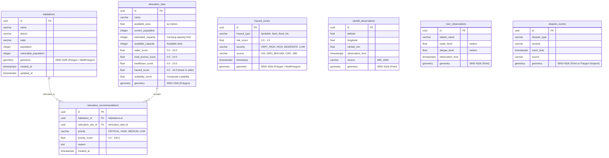

# PostgreSQL + PostGIS Spatial Database Schema
## SIH 2026 — Problem Statement 26191
**Intelligent Identification of Hazard-Based Red Zones, Carrying Capacity Assessment, and Immediate Relocation Needs for Vulnerable Habitations**

---

## 🗺️ Entity Relationship Diagram



---

## 📋 Table Specifications

### 1. `habitations`
Vulnerable and monitored human settlements within disaster-prone jurisdictions.

| Column | Type | Constraints | Description |
|---|---|---|---|
| `id` | `UUID` | `PRIMARY KEY`, Default `gen_random_uuid()` | Unique settlement identifier |
| `name` | `VARCHAR(255)` | `NOT NULL`, Indexed | Official name of the village/settlement |
| `district` | `VARCHAR(100)` | `NOT NULL`, Indexed | District administrative name |
| `state` | `VARCHAR(100)` | `NOT NULL`, Indexed | State administrative name |
| `population` | `INTEGER` | `NOT NULL`, Default `0` | Total resident population |
| `vulnerable_population` | `INTEGER` | `NOT NULL`, Default `0` | High-risk demographic (elderly, children, infirm, low-income) |
| `geometry` | `GEOMETRY(4326)` | `NOT NULL`, **GiST Spatial Index** | Settlement boundary polygon |
| `created_at` | `TIMESTAMPTZ` | `NOT NULL`, Default `now()` | Record creation timestamp |
| `updated_at` | `TIMESTAMPTZ` | `NOT NULL`, Default `now()` | Last modification timestamp |

**Indexes:**
- `idx_habitations_geometry` (`USING gist(geometry)`)
- `idx_habitations_district_state` (`district`, `state`)
- `idx_habitations_name` (`name`)

---

### 2. `hazard_zones`
Delineated spatial red zones representing acute hazard exposure.

| Column | Type | Constraints | Description |
|---|---|---|---|
| `id` | `UUID` | `PRIMARY KEY`, Default `gen_random_uuid()` | Unique zone identifier |
| `hazard_type` | `VARCHAR(50)` | `NOT NULL`, Indexed | Hazard category (`landslide`, `flash_flood`, `earthquake`) |
| `risk_score` | `FLOAT` | `NOT NULL` | Normalized vulnerability score (`0.00` to `1.00`) |
| `severity` | `VARCHAR(20)` | `NOT NULL`, Indexed | Severity tier (`VERY_HIGH`, `HIGH`, `MODERATE`, `LOW`) |
| `source` | `VARCHAR(100)` | `NOT NULL` | Data origin (`GSI`, `ISRO_BHUVAN`, `IMD`, `SDMA`) |
| `timestamp` | `TIMESTAMPTZ` | `NOT NULL`, Indexed | Date/time of hazard delineation |
| `geometry` | `GEOMETRY(4326)` | `NOT NULL`, **GiST Spatial Index** | Red zone boundary polygon |

**Indexes:**
- `idx_hazard_zones_geometry` (`USING gist(geometry)`)
- `idx_hazard_zones_type_severity` (`hazard_type`, `severity`)
- `idx_hazard_zones_time_type` (`timestamp`, `hazard_type`)

---

### 3. `rainfall_observations`
Telemetry observations from Automated Weather Stations (AWS).

| Column | Type | Constraints | Description |
|---|---|---|---|
| `id` | `UUID` | `PRIMARY KEY`, Default `gen_random_uuid()` | Unique reading identifier |
| `latitude` | `FLOAT` | `NOT NULL` | Station latitude (WGS84) |
| `longitude` | `FLOAT` | `NOT NULL` | Station longitude (WGS84) |
| `rainfall_mm` | `FLOAT` | `NOT NULL` | Cumulative rainfall in millimeters |
| `observation_time` | `TIMESTAMPTZ` | `NOT NULL`, Indexed | Timestamp of observation |
| `source` | `VARCHAR(100)` | `NOT NULL` | Telemetry source / station ID |
| `geometry` | `GEOMETRY(POINT, 4326)` | Nullable, **GiST Spatial Index** | Computed Point geometry for spatial joins |

**Indexes:**
- `idx_rainfall_geometry` (`USING gist(geometry)`)
- `idx_rainfall_time_source` (`observation_time`, `source`)

---

### 4. `river_observations`
Central Water Commission (CWC) hydrometric river gauge telemetry.

| Column | Type | Constraints | Description |
|---|---|---|---|
| `id` | `UUID` | `PRIMARY KEY`, Default `gen_random_uuid()` | Unique measurement identifier |
| `station_name` | `VARCHAR(150)` | `NOT NULL`, Indexed | Station name / river location |
| `water_level` | `FLOAT` | `NOT NULL` | Current river water level in meters |
| `danger_level` | `FLOAT` | `NOT NULL` | Flood warning danger threshold in meters |
| `observation_time` | `TIMESTAMPTZ` | `NOT NULL`, Indexed | Timestamp of gauge reading |
| `geometry` | `GEOMETRY(POINT, 4326)` | `NOT NULL`, **GiST Spatial Index** | Station spatial coordinates |

**Indexes:**
- `idx_river_geometry` (`USING gist(geometry)`)
- `idx_river_station_time` (`station_name`, `observation_time`)

---

### 5. `disaster_events`
Historical incidents and active disaster footprints.

| Column | Type | Constraints | Description |
|---|---|---|---|
| `id` | `UUID` | `PRIMARY KEY`, Default `gen_random_uuid()` | Unique event identifier |
| `disaster_type` | `VARCHAR(50)` | `NOT NULL`, Indexed | Disaster category (`landslide`, `flash_flood`) |
| `severity` | `VARCHAR(20)` | `NOT NULL`, Indexed | Impact severity (`CRITICAL`, `SEVERE`, `MODERATE`) |
| `event_time` | `TIMESTAMPTZ` | `NOT NULL`, Indexed | Time of occurrence |
| `source` | `VARCHAR(100)` | `NOT NULL` | Reporting agency / battalion |
| `geometry` | `GEOMETRY(4326)` | `NOT NULL`, **GiST Spatial Index** | Event epicenter or scar polygon footprint |

**Indexes:**
- `idx_disaster_geometry` (`USING gist(geometry)`)
- `idx_disaster_type_time` (`disaster_type`, `event_time`)

---

### 6. `relocation_sites`
Safe evaluated candidate parcels for habitation relocation outside hazard zones.

| Column | Type | Constraints | Description |
|---|---|---|---|
| `id` | `UUID` | `PRIMARY KEY`, Default `gen_random_uuid()` | Unique candidate parcel identifier |
| `name` | `VARCHAR(255)` | `NOT NULL`, Indexed | Site designation / name |
| `available_area` | `FLOAT` | `NOT NULL` | Usable land area in square meters |
| `current_population` | `INTEGER` | `NOT NULL`, Default `0` | Existing population hosted |
| `estimated_capacity` | `INTEGER` | `NOT NULL` | Maximum carrying capacity limit |
| `available_capacity` | `INTEGER` | `NOT NULL`, Indexed | Remaining available capacity slots |
| `water_score` | `FLOAT` | `NOT NULL` | Potable water score (`0.0` to `10.0`) |
| `road_access_score` | `FLOAT` | `NOT NULL` | All-weather road connectivity score (`0.0` to `10.0`) |
| `healthcare_score` | `FLOAT` | `NOT NULL` | Medical proximity score (`0.0` to `10.0`) |
| `hazard_score` | `FLOAT` | `NOT NULL` | Environmental hazard residual score (lower is safer) |
| `suitability_score` | `FLOAT` | `NOT NULL`, Indexed | Composite multi-criteria carrying capacity index |
| `geometry` | `GEOMETRY(4326)` | `NOT NULL`, **GiST Spatial Index** | Site parcel boundary polygon |

**Indexes:**
- `idx_relocation_sites_geometry` (`USING gist(geometry)`)
- `idx_relocation_sites_capacity` (`available_capacity`)
- `idx_relocation_sites_suitability` (`suitability_score`)

---

### 7. `relocation_recommendations`
Algorithmic priority allocations mapping vulnerable habitations to safe carrying-capacity sites.

| Column | Type | Constraints | Description |
|---|---|---|---|
| `id` | `UUID` | `PRIMARY KEY`, Default `gen_random_uuid()` | Unique recommendation identifier |
| `habitation_id` | `UUID` | `FOREIGN KEY` -> `habitations.id` `ON DELETE CASCADE`, Indexed | Habitation requiring evacuation |
| `relocation_site_id` | `UUID` | `FOREIGN KEY` -> `relocation_sites.id` `ON DELETE CASCADE`, Indexed | Target destination parcel |
| `priority` | `VARCHAR(20)` | `NOT NULL`, Indexed | Priority level (`CRITICAL`, `HIGH`, `MEDIUM`, `LOW`) |
| `priority_score` | `FLOAT` | `NOT NULL` | Multi-criteria urgency score (`0.0` to `100.0`) |
| `reason` | `TEXT` | `NOT NULL` | Explainable algorithmic justification |
| `created_at` | `TIMESTAMPTZ` | `NOT NULL`, Default `now()`, Indexed | Timestamp of recommendation calculation |

**Indexes:**
- `idx_recs_habitation` (`habitation_id`)
- `idx_recs_site` (`relocation_site_id`)
- `idx_recs_priority_score` (`priority`, `priority_score`)
- `idx_recs_created_at` (`created_at`)

---

## 🛠️ Spatial Utility Functions (`backend/app/db/spatial_queries.py`)

1. **`get_habitations_in_hazard_zones(db, hazard_type, severity)`**:
   Performs fast indexed spatial intersection (`ST_Intersects`) between habitation polygons and hazard red zones.
2. **`get_habitation_hazard_exposure(db, habitation_id)`**:
   Computes exact square-meter area overlap (`ST_Area(ST_Transform(ST_Intersection(...), 3857))`) and percentage of settlement territory engulfed in red zones.
3. **`find_nearest_safe_relocation_sites(db, habitation_id, max_distance_meters, min_capacity)`**:
   Calculates geodesic ellipsoidal distance (`ST_Distance(h.geometry::geography, rs.geometry::geography)`), checks available capacity, and verifies candidate sites do not intersect any active `VERY_HIGH` hazard zone.
4. **`get_active_river_danger_alerts(db)`**:
   Filters gauges where `water_level >= danger_level`, returning exceedance margins in meters.
5. **`get_rainfall_in_radius(db, lon, lat, radius_meters, hours)`**:
   Finds telemetry stations within spatial buffer using `ST_DWithin` on geography.

---

## 🗄️ Migrations & Database Seeding

### Apply Migrations
```bash
alembic upgrade head
```

### Seed Demonstration Dataset (Wayanad, Kerala)
```bash
python -m backend.app.db.seeds
```
Seeds 4 habitations (Chooralmala, Mundakkai, Attamala, Meppadi), 4 red zones, rainfall AWS telemetry, river stations, disaster footprints, 3 safe candidate relocation parcels, and prioritized recommendations.
